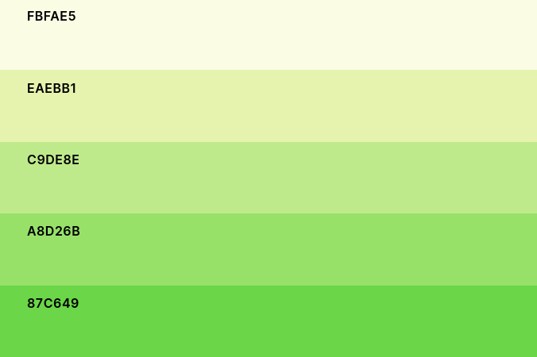

# Descripción del proyecto

Se define el problema de diseñar e implementar una página web para un centro de exposiciones, las cuales tienen una fecha de inicio y fin, un autor y una sala asociada. También se pueden clasificar por categorías. Cada exposición posee un conjunto de piezas, las cuales también se deben poder consultar.

Además, la web dispone de un sistema de usuarios, de forma que cualquier visitante puede darse de alta y el administrador del sitio puede nombrar a un usuario registrado comisario, pudiendo entonces editar el contenido del sitio web.

Se han aplicado ciertas pautas de estilos, diseñado un logo y utilizado estructuras visuales amigables, atendiendo a criterios de diseño y de accesibilidad. Además, la página principal es responsiva, de forma que al modificar la anchura de la pantalla la distribución de los objetos cambia para adaptarse a dispositivos móviles.

# Estructura de contenidos 

La práctica consiste en el desarrollo, a nivel de estructura, contenido y estilo, de un sitio web dedicado a un centro de exposiciones. Para ello, se ha diseñado e implementado una página principal ([`index.html`](exposiciones/index.html)) compuesta de una cabecera, una barra de navegación y un pie de página. Estos cuatro elementos se repiten y son comunes a todos los documentos del sitio web.

Además de estos componentes se incluye un bloque principal que aloja el contenido fundamental de la página. En el caso de la página principal se divide en una columna lateral en la que se pueden ver titulares y enlaces a noticias relevantes y relacionadas con el centro de exposiciones, junto con una sección en la que se presentan las exposiciones actuales y futuras.

Si se hace clic en una de las exposiciones, la web redirige a un documento propio de la exposición (`expo*.html`) que contiene información genérica de la misma junto con una serie de imágenes seleccionables de las piezas que componen la exposición. Asimismo, si se selecciona una de las obras, se abrirá una página (`expo*_pieza*.html`) con una imagen más grande e información detallada de la pieza.

Por su parte, la cabecera contiene, además del logo y el título, un formulario para que los usuarios de la plataforma inicien sesión, a su vez que darse de alta y, si procede, dar de alta a un comisario.

Para darse de alta como usuario es necesario rellenar un formulario que se encuentra en [`altapublico.html`](exposiciones/altapublico.html), y para dar de alta a un comisario debe hacerlo un administrador en el formulario situado en [`altacomisario.html`](exposiciones/altacomisario.html), donde debe indicar qué usuario quiere que sea nombrado comisario junto con un correo electrónico al cual se enviaría una notificación.

Sobre la barra de navegación, contiene enlaces a documentos que muestran exposiciones clasificadas por categorías, concretamente fotografía ([`fotografia.html`](exposiciones/fotografia.html)), pintura ([`pintura.html`](exposiciones/pintura.html)), cine ([`cine.html`](exposiciones/cine.html)) y escultura ([`escultura.html`](exposiciones/escultura.html)).

En el pie de página podemos encontrar un enlace a este documento PDF y a otra página con información sobre mí ([`contacto.html`](exposiciones/contacto.html)).

# Consideraciones de diseño

Con respecto a los asuntos más centrados en el diseño, debemos tener en cuenta que es una web de un centro de exposiciones en la cual se pueden ver las obras, por lo que las imágenes deben llamar la atención. El visitante del sitio debe fijarse más en las piezas que en los elementos propios de la página, que deben pasar a un segundo plano, por lo que no debemos utilizar aspectos visuales que sean demasiado llamativos, decantandonos así por diseños más minimalistas y más sobrios. En la siguiente imagen vemos el logo que hemos utilizado, compuesto de una pequeña imagen de una paleta de pinturas, representando una de las categorías que ofrece el centro de exposiciones: la pintura, que es probablemente el primer aspecto que se viene a la cabeza al hablar de arte.

{width="60%"}

Hemos elegido 'Expose It!' como nombre del centro porque es un nombre corto, sencillo, y fácil de pronunciar, a la par que adecuado a la situación.

Junto con el logo, se determinó también una paleta de colores que evocan al propio logo, siendo estos claros y poco llamativos, a excepción de los que son usados para centralizar la atención.

{width="70%"}

Los colores más claros son utilizados en fondos de los distintos elementos mientras que los más oscuros e intensos se utilizan en efectos 'hover', en las cabeceras, en los bordes o en el footer.

Respecto a las fuentes, de acuerdo al tema que estamos tratando, que se mueve en un ambiente generalmente formal y respetuoso, pensamos que sería indicado utilizar letras en esta línea, por lo que se han utilizado las fuentes 'Georgia' y 'Times New Roman'.

{width="100%"}

Además, se han cuidado aspectos como que la paleta esté a prueba de daltónicos (comprobado por mí mismo), letra grande para gente con problemas de visión e imágenes también de tamaño grande por el mismo motivo pero también de nuevo para centrar la atención en las imágenes.

# Aspectos innovadores

La práctica se ha desarrollado utilizando HTML5 y CSS3 puro, es decir, sin ayuda de ningún framework de desarrollo. Sin embargo, sí se han utilizado algunas páginas web que generan por sí solas código HTML+CSS para aportar aspectos visualmente más llamativos o para facilitar la programación de aspectos más complejos.

Las herramientas utilizadas han sido:

* [grid.layoutit.com](https://grid.layoutit.com/): Una web interactiva que permite organizar de manera sencilla los elementos en forma de malla. Con tan solo indicarle las áreas que queremos, sus tamaños y nombres, la propia web genera código HTML y CSS de acuerdo a la estructura pedida.
* [Best CSS Button Generator](https://www.bestcssbuttongenerator.com/): Los botones de la práctica han sido elaborados con esta plataforma que nos permite ajustar parámetros estéticos del botón, generando el código necesario para incrustarlo en nuestros documentos.
* [app.brandmark.io](https://app.brandmark.io/v3/): Una página que diseña logos y paletas de colores acorde a una serie de conceptos y palabras clave que se le indiquen. Con esta web han sido elegidos los logos y la paleta de colores.
* [codepen.io](https://codepen.io/ssmkhrj/pen/MWjpWKp?editors=1100): "The best place to build, test, and discover front-end code". En esta plataforma los usuarios insertan fragmentos de código HTML+CSS+JavaScript diversos. Particularmente, yo he utilizado la animación que se puede encontrar en el enlace para la selección de piezas en los documentos `expo*.html`.
* [css-tricks](https://css-tricks.com/snippets/css/a-guide-to-flexbox/): Aunque realmente se podría considerar más bien una web informativa, gracias a la guía de `flexbox` que encontré, la cual incluye ejemplos muy ilustrativos, pude realizar algunos contenedores muy estéticos. 
* [forosalvaje.com](https://forosalvaje.com/): Un foro por y para desarrolladores. En este foro y gracias a su CEO ([@Sdesalvaje](https://twitter.com/Sdesalvaje?ref_src=twsrc%5Egoogle%7Ctwcamp%5Eserp%7Ctwgr%5Eauthor) en Twitter) encontré muchos de estos recursos y el efecto de 'polaroid' que podemos ver en los documentos `expo*_pieza*.html`  en `contacto.html`.
  
